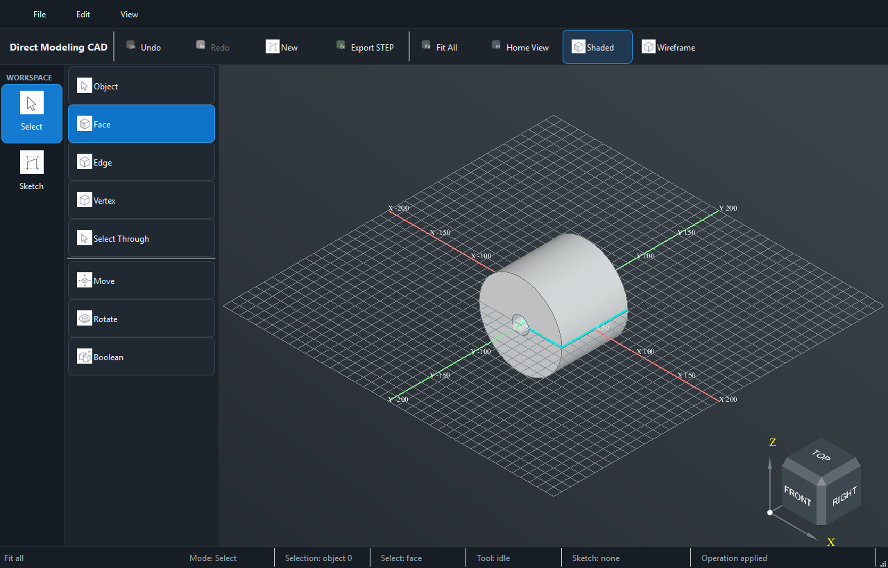

# mini-cad

A small direct-modeling CAD I built (vibe-coded, with heavy AI help) because I
needed to **prototype simple 3D models fast** — sketch something, extrude it,
cut, move, fillet, export STEP, move on.

It is **not** trying to be FreeCAD or Fusion. On purpose. The goal is a compact,
no-friction desktop CAD for quick model prototyping: open it, get a shape out,
export, done — without fighting a heavyweight tool.

<p align="center">
  
  <br>
  <!-- A short feature-tour GIF can replace this still later:
        -->
  <sub><em>Selection-first: pick a face, edge, or vertex and the matching tools light up.</em></sub>
</p>

## ✓ What it does

- **Sketch:** line, arc, circle, center & 3-point rectangle, trim, editable
  dimensions, and sketches hosted on a selected face.
- **Solids:** box bodies, push/pull extrude, sketch extrude/cut, new body from
  sketch, revolve, face removal, body transforms.
- **Booleans:** union, subtract, intersect between bodies.
- **Direct editing:** move bodies, faces, edges, vertices, and sketch geometry.
- **Finishing:** fillet, chamfer, threads, mirror, rib.
- **Snapping:** while sketching, the cursor snaps to a face's edges/vertices,
  the grid, and other bodies; hold **Ctrl** to also snap to the grid while
  dragging.
- **Measure:** edge length, radius/diameter, axis distance for round features.
- **Files:** native `.cadproj` save/load + STEP import/export.

## ✗ What it deliberately doesn't (yet)

- No assemblies, mates, or a full parametric constraint solver — dimensions are
  editable, but this is direct modeling, not history-driven parametrics.
- No mesh/STL export — STEP only.
- Linux is work-in-progress; Windows is the supported runtime today.
- It's a prototype. Expect rough edges and the occasional "that face can't be
  extruded" when geometry gets unusual.

## Keyboard

| Key | Action | Key | Action |
|-----|--------|-----|--------|
| `Arrows` | orbit camera around object | `1`/`2`/`3`/`4` | select object/face/edge/vertex |
| `F` | fit all | `S` | start sketch on selection |
| `H` | home view | `E` / `Shift+E` | push-pull / extrude inward |
| `G` or `M` | move | `R` | fillet/chamfer (or rectangle in a sketch) |
| `X`/`Y`/`Z` | constrain move axis | `Ctrl` (drag) | snap to grid/geometry |
| `Esc` | cancel | `Enter` | commit / finish sketch |
| `Ctrl+Z` | undo | `Del` | delete selection |

## Requirements

- Python 3.10+ (3.11 recommended for the OCP wheels).
- `PySide6`, `cadquery-ocp`, `build123d`, `shapely`.

## Install

```powershell
py -3.11 -m venv .venv
.\.venv\Scripts\python.exe -m pip install --upgrade pip
.\.venv\Scripts\python.exe -m pip install -e ".[dev]"
```

## Run

```powershell
.\run.ps1 app
```

…or, after install, the `cad-app` entry point. On Linux/macOS there's `./run.sh`
(`./run.sh app`, `./run.sh check`, `./run.sh test`).

## Layout

- `cad_app/` — application code: modeling commands, viewer, UI, project IO.
- `dev/` — local workflow & smoke scripts.
- `docs/` — architecture notes and behavior contracts.
- `tests/` — contract tests (core geometry + UI), run with `./run.sh check`.

## How it's built

Selection-first direct modeling: whatever you have selected — body, face, edge,
vertex, or sketch profile — decides which commands light up. The code favors
many small, explicit modeling operations over one big framework, so each
feature is easy to find and change. Yes, it was built with heavy AI assistance;
the contracts in `docs/` exist so behavior stays honest as it grows.

## Author

Pawel Zduniak — MIT licensed, see [LICENSE](LICENSE).
